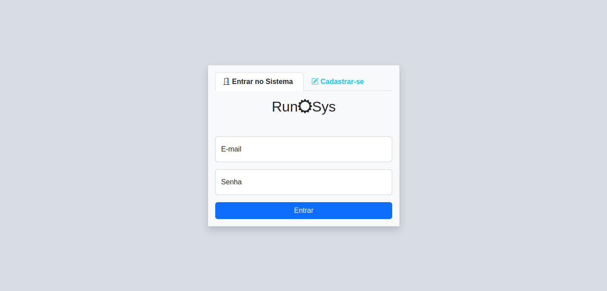
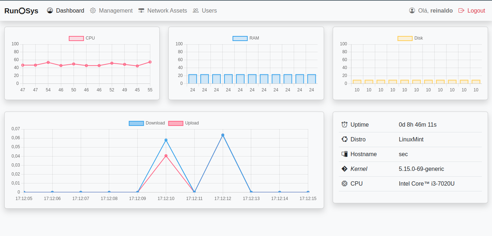
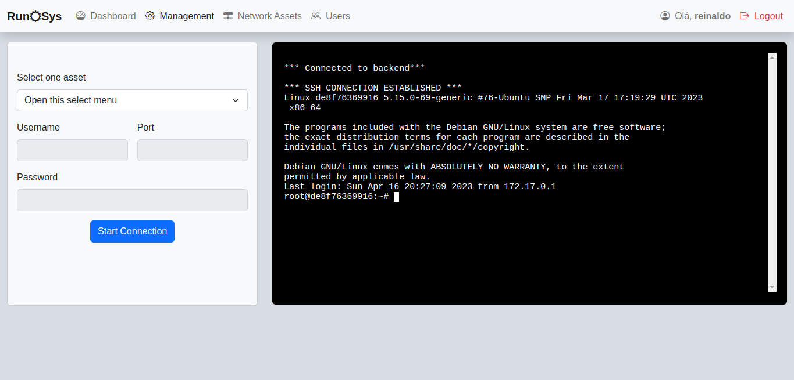
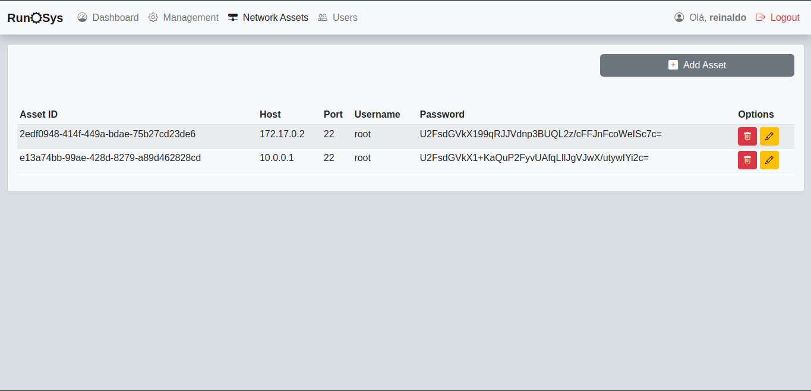
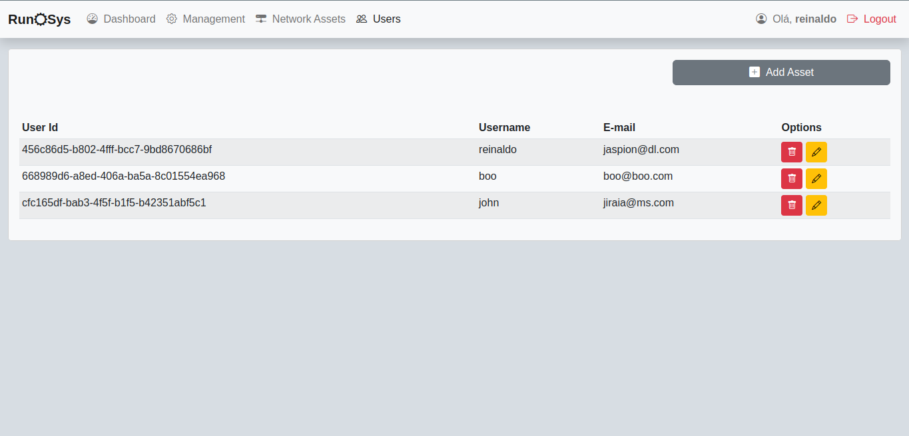

# RunSys

RunSys é uma idéia de projeto para disciplina de Desenvolvimento Web do IFPB - Campus João Pessoa. Está aplicação é uma solução para automatização de alguns processos de configuração de ativos de redes (Routers, Switchs) facilitando a vida do administrador.

## Screenshots












## Funcionalidades

- Início.
  - Chart do trafico de rede.
  - Chart de uso de Memoria e CPU.
  - Uptime do servidor.
  - Card com informações do sistema operacional.
- Ativos de Rede.
  - CRUD para ativos de redes.
- Usuários
  - CRUD para usuários.
- Gerenciamento.  
  - Terminal Simples para conexão SSH.

## Stack utilizada

**Front-end:** HTML, CSS, Boostrap, Javascript.

**Back-end:** Node, Express, Prisma, SSH2, bcrypt, crypto-js, systeminformation, mysql, dotenv.

## Variáveis de Ambiente

Para rodar esse projeto, configurar as variáveis de ambiente dentro do .env renomeio o .env.example para .env ee preencha as variáveis de ambiente.

## Requisitos de instalação

- Docker e Docker Compose.

## Rodando localmente

Clone o projeto

```bash
  git clone https://github.com/mr-reinaldo/runsys.git
```

Entre no diretório do projeto

```bash
  cd runsys
```

```bash
  docker-compose up -d
```

Em seguida, acesse o endereço http://localhost:3000 no seu navegador.


## 🚀 Sobre nós

Somos um grupo de estudantes do IFPB - Campus João Pessoa, que estão cursando o 4º período do curso de Redes de Computadores.

### 👨‍💻 Equipe:

<table>
  <tr>
	  <td align="center">
		<a href="https://github.com/mr-reinaldo">
		
			<br />
			<sub><b>José Reinaldo</b></sub>
		  </a><br /><a href="https://github.com/mr-reinaldo" title="mr-reinaldo">👨‍🚀</a>
	  </td>
	  <td align="center">
		<a href="https://github.com/mjldl">
		
			<br />
			<sub><b>Matheus Jabes</b></sub>
		  </a><br /><a href="https://github.com/mjldl" title="mjldl">👨‍🚀</a>
	  </td>
	  <td align="center">
		<a href="https://github.com/joseroldao27062002">
		
			<br />
			<sub><b>José Roldão</b></sub>
		  </a><br /><a href="https://github.com/joseroldao27062002" title="joseroldao27062002">👨‍🚀</a>
	  </td>
  </tr>
</table>